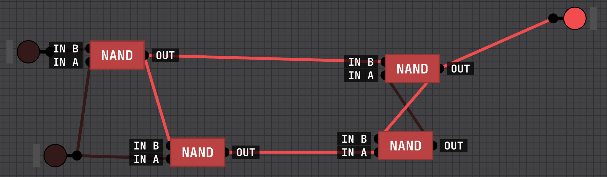
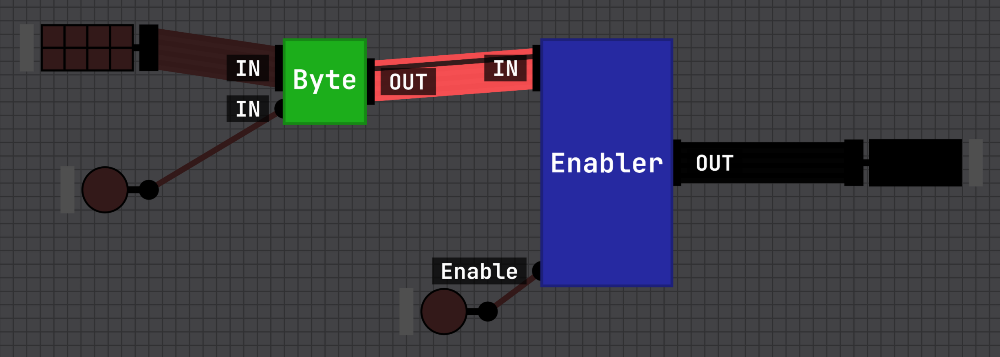
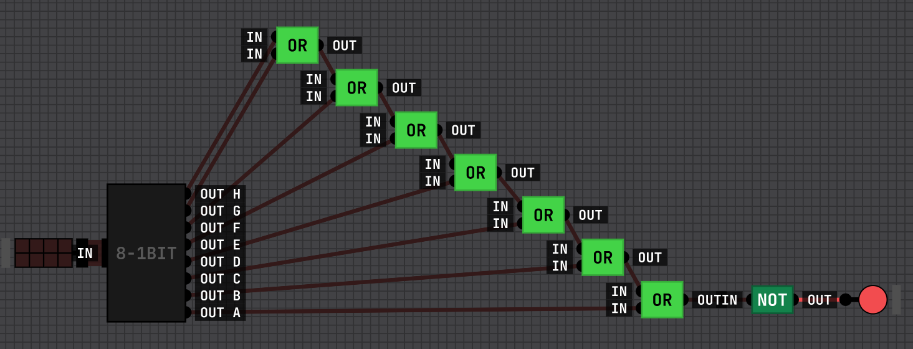

# Chapter 1

## First half of the computer

### Logic gates

Logic gates are electrical components that make up a computer, they exist in the silicon chips and other components.

#### NAND Gate

The simplest of the gates is the NAND gate. It has 2 inputs and one output. The output is always on, unless both inputs are on, then it is off.

#### NOT Gate

The NOT gate is a combination of NAND gates to create a gate that gives the opposite output of it's input.

#### AND GATE

The AND gate is a combination of a NAND gate and a NOT gate. I is always off, unless both inputs are on, then it is on.

#### 4 input AND Gate

AND gates can be combined together to require more inputs

### Bit

Bits are built from NAND gates. There are 2 inputs and one output. The first input is the state we want to capture. The second input is the selector.

When the selector is switched on, the state of the first input is captured. When the second input is switched off the state of the first input is stored. The output will stay the stored value until the second input is switched on and the first input is in a different state.

### Bits, Nibbles, Bytes

Bits make up the memory of the system.

A byte is a collection of 8 ordered bits, a nibble is 4.

Bytes can be used to represent data such as [ASCII](https://en.wikipedia.org/wiki/ASCII) characters.

### Register

#### Enabler

An enabler is a byte in-front of another byte that decides when the output will be made available.

#### Register

A register is a combination of a byte and an enabler.

### Bus

A bus is a bundle of 8 wires connecting register inputs and outputs.

### Decoder

The number of outputs of a decoder are equal to the number of possible different input options that are available (2x4, 3x8, 4x16, 5x32, 6x64).

This 4x16 decoder is what is used for our ram to indicate a column or row to activate.

### Ram

#### Ram Register

This is what exists at every point in the ram grid.

#### 16 Ram Registers in Column

This is a column of 16 ram storage locations.

#### 16 Ram Registers Columns

This is a row of 16 storage locations columns built above.

#### 256 Bytes Ram

This ram has an 8 bit register (Memory Address Register / MAR) to indicate which of the 256 locations to read/write from/to.

The MAR is broken down with 2 decoders for the X and Y axis' of the storage location grid.

There is an enable input to allow for reading from a location and a set button to allow for writing to a location.

This is an example of the ram being used. Here we are reading the memory stored at the 0x04 address.

## Other half of the computer

### OR Gate

OR gates are on if either or both inputs are on.

XOR gate are only on if one of the inputs are on, it is off if both are on.

### XOR Gate

### Shifters

Shifter shift the bytes in a register over in one direction.

#### Left Shifter

The left shifter shifts bytes left ie. `0000 1100` (12) becomes `0001 1000` (24). Multiplying the value by 2.

#### Right Shifter

The right shifter shifts bytes right ie. `0000 1100` (12) becomes `0000 0110` (6). Dividing the value by 2.

### NOTer (Inverter)

The inverter flip the bits to the opposite.

### ANDer

The ANDer takes 2 input bytes and ANDs each bit.

### ORer

The ORer takes 2 input bytes and ORs each bit.

### XORer

The XORer takes 2 input bytes and XORs each bit.

### ADDERS

#### ADDER 2 bit

Takes in 2 bits and outputs a SUM and a CARRY.

#### ADDER 3 bit

Takes in 3 bits and outputs a SUM and a CARRY.

#### ADDER 8 bit

Takes in 2 bytes and a CARRY IN then outputs a SUM byte and a CARRY OUT.

### Comparator

Comparators take 2 inputs and output whether or not they are equal and if a is larger than b. It also outputs an XOR result.

#### Comparator 1 bit

#### Comparator 8 bit

### Zero

The Zero takes a byte and outputs a bit that is only on when all bits in the input are zero.

### Arithmetic and Logic Unit

The ALU combines the above 7 logic operations and makes them available in one place. You use a `op` inputs to select which operation you would like to perform along with 2 input bytes and a `carry in` if needed. It will output the result of the operation `c`, if it is `zero`, the `carry out`, and the `larger` and `equal` results from comparison.

### Bus 1

### Clock

#### Clock

A clock is made by connecting the output of a NOT gate to it's input. This will cause it to flip on / off forever.

#### Clock with delay

We want to create a delay in the clock to be able to space out our operations. We are delaying the clock by half a step.

#### Clock main

`clk s` the set clock is shorter and is used to set the register we are operating on. This is on when both our clock and delayed clock is on.

`clk e` the enable clock is longer and is used to enable the register we are operating on. This is on when either our clock or delayed clock is on.

`clk` is the main, normal timed clock.

### Stepper

