# Chapter 2

This chapter we build on what we have built by combining the stepper with setters and enablers to perform the functions we would like.

## Enable / Set

All the enablers will be connected to the enable clock and all the setters will be connected to the set clock. All these connections will be separated with an AND gate to all us to choose when the components will be enabled / set.

## Steps

We can use the stepper to step through a set of instructions we would like are system to go through. These steps involve activating sets and enables to determine the path we would like things to flow.

## Instruction Register (IR)

The IR stores the current instruction to run.

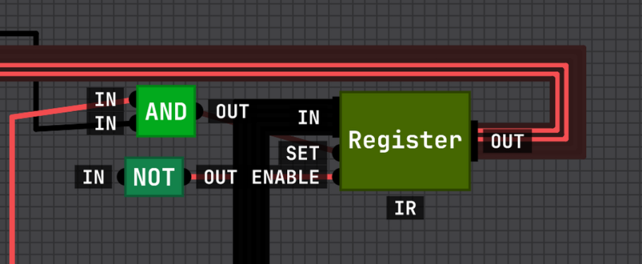

## Instruction Address Register (IAR)

The IAR stores the address for the next instruction.

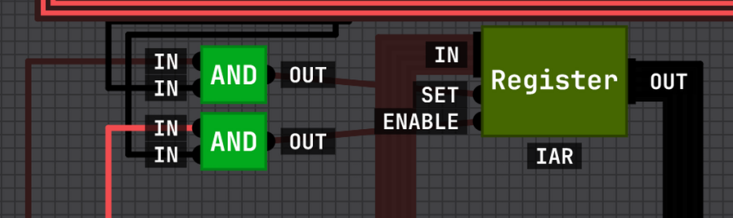

## Instructions

We will use the first 3 steps of the stepper to move our program along. This is done by:

1. Set the address in ram to the address in the IAR and one to it in the ACC.
2. Retrieve the instructions from RAM and store it in the IR.
3. Set the IAR to the ACC value (last IAR with 1 added).

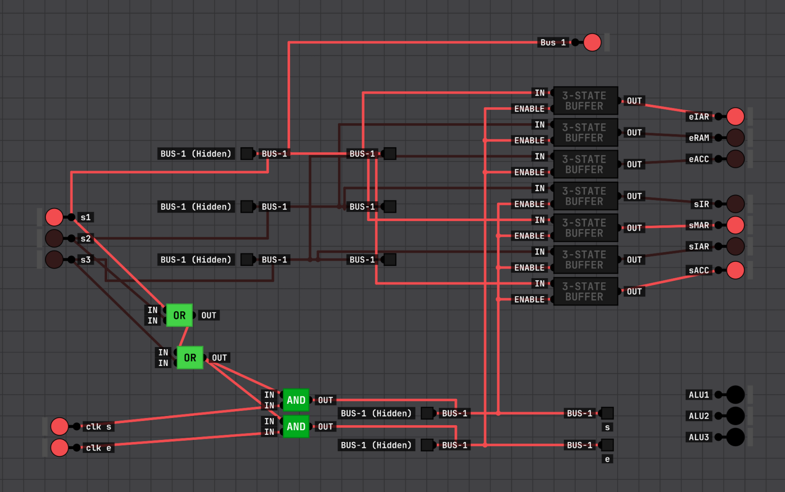

### Coding

We need to come up with a coding for our IAR values. This will allow us to determine what will actually happen within our steps 4, 5, and 6.

## ALU Instructions

If the first bit of our IR is 1, this is a ALU instruction. The next 3 bits are dedicated to selecting an ALU instruction. The next 2 are for the location of Reg A, the next 2 for Reg B.

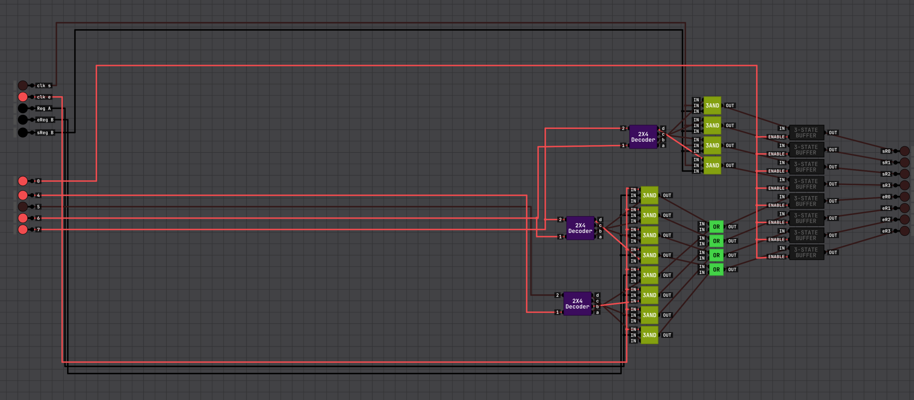

### Steps

1. Move the contents of Reg B into TMP.
2. Move the contents of Reg A into ACC, running the ALU calculation.
3. Move the contents of ACC into Reg B.

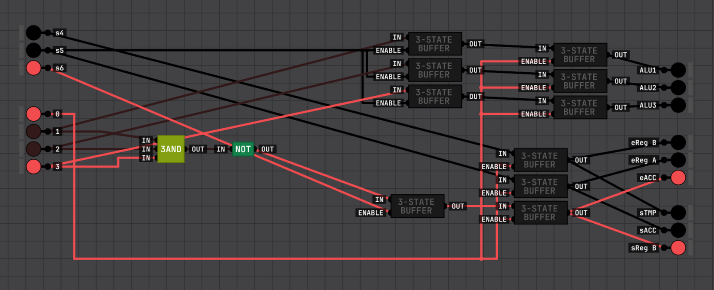

## Load and Store Instructions

If the first bit of our IR is 0, this is a load and store instruction.

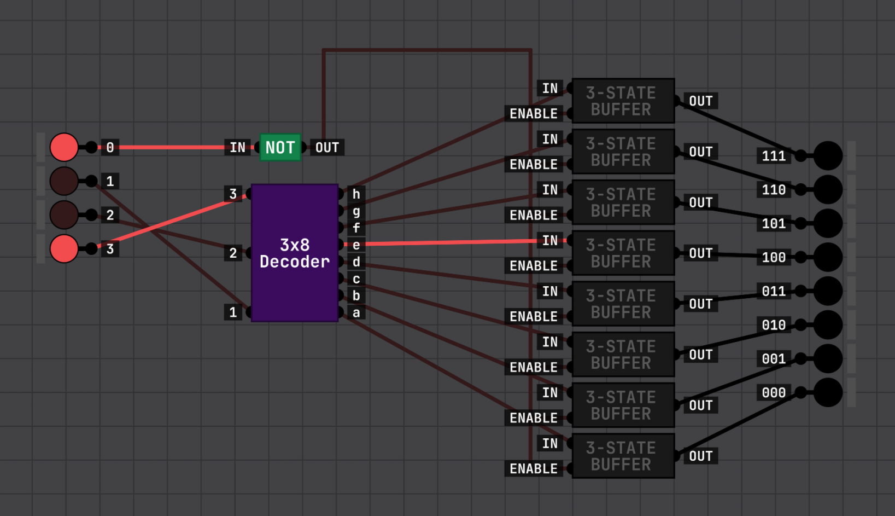

### Load / Store

000 - Load instructions load RB from RAM using RA address.

001 - Store instructions store RB to RAM address in RA.

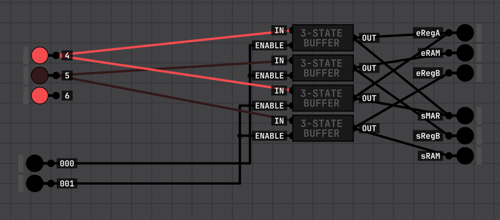

### Data

010 - Load the data from where the next instruction should be into RB.

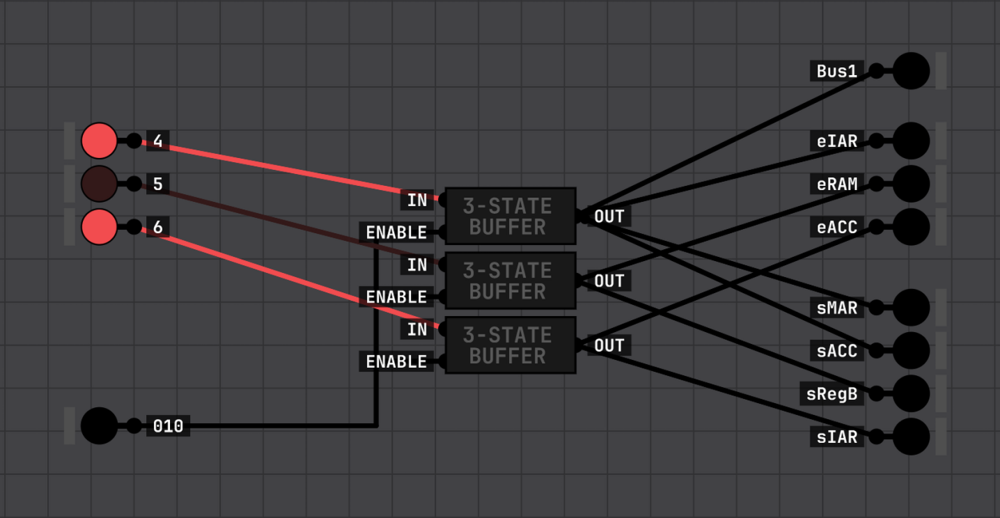

### Jump Register

011 - Set IAR to value of RB

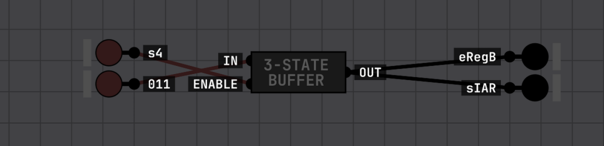

### Jump

100 - Set IAR to the ram address of the next byte.

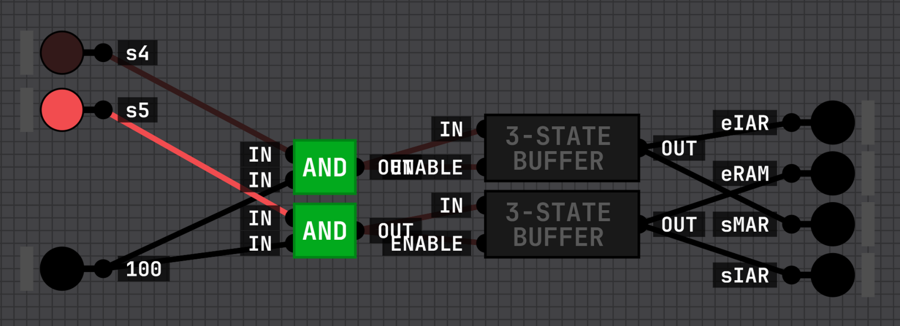

### Jump If

101 - Jump if we get an expected output from one of the flags.

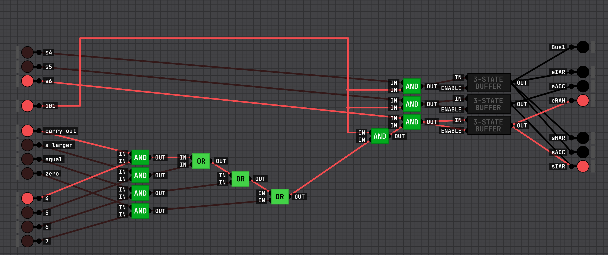

### Clear Flags

110 - Clear the currently set flags

## IO

IO gets connected to the main bus and has some other connections to enable or set on the IO device.

### Display

A display has it's own set of ram with separated ready and write operations. The read operations are only available to the display it's self, and the write operations are available to the computer. The computer sets the display ram to what it should display and the display scans through the ram to update the pixels.

### Drives

Drives have to move the head to specific locations and read entire blocks out. It sends these block byte by byte through the bus to the CPU for it to load it from the registers to RAM for any operations is whats to do on it.

## Rest of book

The rest of the book gives an overview of different peripherals and philosophies.
